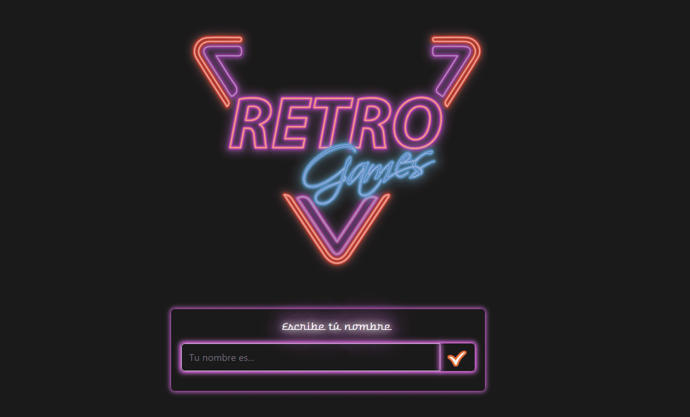
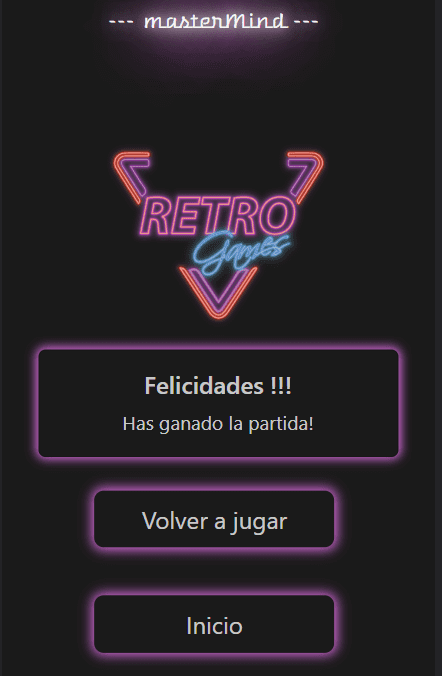

<h1 align="center">Geekshubs Academy FSD 04-2023</h1>

<h1 align="center">Third project - MasterMind Game</h1>

## Table of Contents

- [About project:thought_balloon:](#about-project)
- [Functionality:computer:](#functionality)
- [Process:hourglass:](#process)
- [Used technology:white_check_mark:](#used-technology)
- [License and Copyright:pencil::copyright:](#license-and-copyright)

### About project:

This third project is the first dynamic project created with JS. The purpose is to be able to play with a dynamic board, being able to choose the color we want and depending on the answer we get white or red chips on the right side.

#### Depending of the level you have more or less attempts to play:
- Beginner level consists of 4 colors to choose from and 10 attempts.
- Intermediate level consists of 5 colors to choose from and 8 attempts;* 
- Advanced level consists of 6 colors to choose from and 6 attempts.

####The game ends in two ways:
- when you have matched all the coolores, you will be redirected to the winner's page;
- when you have exhausted all attempts, you will be redirected to the page where you will have several options to follow.

### Functionality:

This game consists of several pages that you can access through steps to follow in game mode or from the main page. 
####From the main page you can access to the page where the game starts:

> 

####Or to the page where you can read information about the game and access the game author's personal page:

> 

####Once you have introduced your name, you will be redirected to the level selection page:

> 

####Next, it take you to the choice of colors, depending of the level you have more or less colors to choose from:

> 

####Finally it takes you to the board page and to play ;)

> 

####Depending on the answer you get, it will take you to one or another final window of the game:

>   

### Process:

This project was developed with HTML5, CSS3 and JavaScript. The game website is adapted to be responsive and with a minimalist aesthetic, using neon style colors on a dark background. In addition to using Bootstrap for better distribution of the elements, although I used my own CSS style. It has been a big personal challenge.

***In order to carry out the functionality of the game, I have implemented the JS knowledge of functions, variables and const in addition to:***

####DOM/BOM: 
>- *createElement(),*
>- *documentElement(),*
>- *getElementById(),*
>- *querySelector() and querySelectorAll()*

####Array methods:
>- *.lenght,*
>- *.indexOf(),*
>- *Array.from(),*
>- *.includes(),*
>- *.forEach(),*
>- *.map(),*
>- *.splice(),*
>- *and others...*

####Loops:
>- *for;*
>- *if/else;*

### Font:
>- *"Warnes", Helvetica, sans-serif;*

### Used technology

### License and Copyright

*Add MIT Licence. The style is completely created by Anastasiia Kosovets, the images of the **about.html** page as well as the main logo are taken from the free svg image server.* 